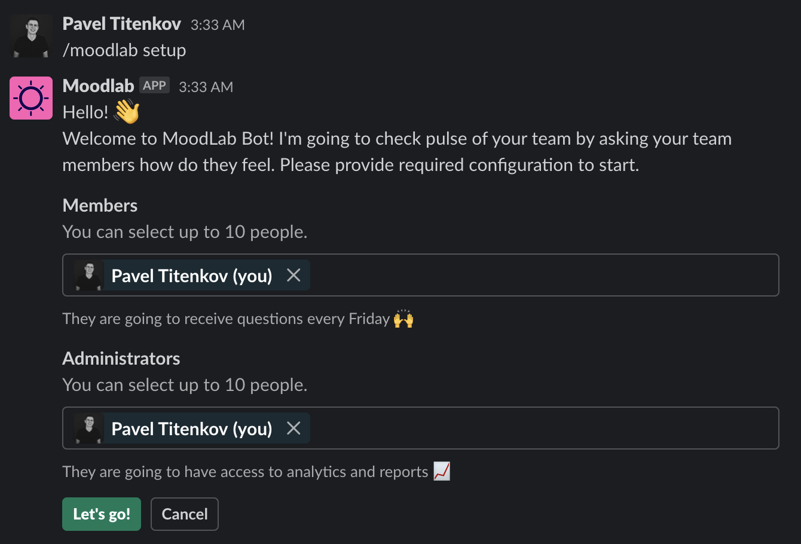
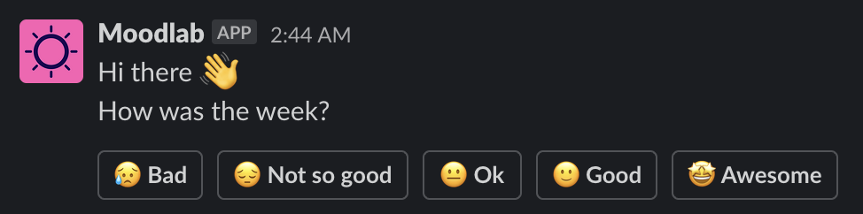

# Team Mood Bot

[`titenkov/team-mood-bot`](https://github.com/titenkov/team-mood-bot) allows
you to track the mood of your teamates by asking simple questions at the end of the working week.

[](https://opensource.org/licenses/MIT)

🌈 The concept is very simple. If you're a good manager (leader) - you care about your people. Sometimes it might be tricky to keep control of everything happening in the team, so you might want to automate a bit feedback gathering.

🪄 Moodlab is going to ask your team members how do they feel at the end of each week and provide you reports.

Please visit [`moodlab`](https://moodlab.pages.dev) to know more.

[](https://slack.com/oauth/v2/authorize?client_id=3594698470180.3624950044596&scope=chat:write,commands,im:write,team:read,users:read,users:read.email,im:read&user_scope=)

## Demo





## Features

📬 Recieve alert immediately when someone in your team is disappointed

📈 Get access to the statistics over time for each team member and team in general (coming soon)

✨ Customize the question(s) and build an anonymous feedback channel (coming soon)

## Requirements

* Node.js
* Wrangler <https://github.com/cloudflare/wrangler>

## Technology

This application works on [Cloudlare Workers](https://workers.cloudflare.com). All data is stored in [Cloudflare Workers KV](https://www.cloudflare.com/en-gb/products/workers-kv).
You can easily deploy your own Cloudflare Workers project.

[](https://deploy.workers.cloudflare.com/?url=https://github.com/titenkov/team-mood-bot)

You need to specify the environment variables for `SLACK_BOT_TOKEN` and `SLACK_VERIFICATION_TOKEN`.

```
wrangler secret put SLACK_BOT_TOKEN
wrangler secret put SLACK_VERIFICATION_TOKEN
```

You will also need to create your own workers kv.

```
wrangler kv:namespace create KV_TEAM_MOOD_BOT
```

Finally set your Worker URL https://team-mood-bot.username.workers.dev as Slack webhook URL.

## Contribution

You can run and play with it locally in `dev` mode
~~~
$ yarn dev
~~~

## Author

Pavel Titenkov <https://github.com/titenkov>
